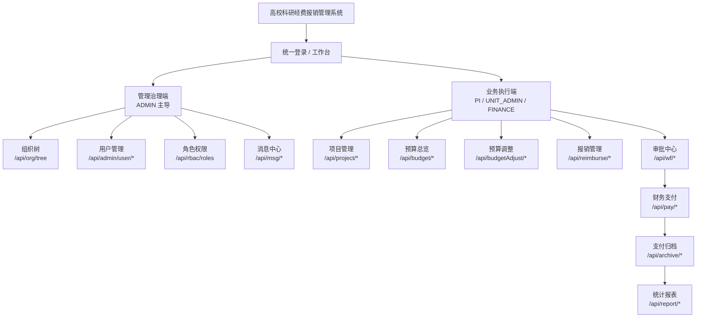

# 高校科研经费报销管理系统——组织机构图与业务图（简版）

> 依据当前代码中的角色模型、组织树接口、审批流接口与前端路由权限整理。

## 1) 业务功能结构图（树状直观版，接近示例样式）

```text
高校科研经费报销管理系统
┌──────────────────────────────────────────────────────────────────┐
│                          统一登录 / 工作台                        │
└──────────────────────────────────────────────────────────────────┘
                 ┌──────────────────────────────┴──────────────────────────────┐
                 │                                                             │
        ┌───────────────────────┐                                   ┌───────────────────────┐
        │       管理治理端       │                                   │       业务执行端       │
        │      (ADMIN 主导)      │                                   │   (PI/UNIT/FINANCE)    │
        └───────────────────────┘                                   └───────────────────────┘
     ┌───────┬──────────┬──────────┬──────────┐               ┌─────────┬─────────┬─────────┬─────────┬─────────┐
     │组织树 │用户管理   │角色权限   │消息中心   │               │项目管理  │预算总览  │预算调整  │报销管理  │审批中心  │
     │/org   │/admin/user│/rbac     │/msg      │               │/project │/budget  │/budgetAdj│/reimburse│/wf      │
     └───────┴──────────┴──────────┴──────────┘               └─────────┴─────────┴─────────┴─────────┴─────────┘
                                                                              │
                                                                              ▼
                                                                  ┌───────────────────────┐
                                                                  │ 财务处理与监管分析     │
                                                                  │ /pay /archive /report │
                                                                  └───────────────────────┘
```

## 2) 业务功能结构图（Mermaid 版）



## 3) 角色职责（简洁版）

| 角色 | 定位 | 关键职责 |
|---|---|---|
| ADMIN | 系统治理 | 维护组织、创建用户、分配角色、全局查看与审批 |
| PI | 业务发起 | 发起/维护项目、预算调整、报销等业务单据 |
| UNIT_ADMIN | 单位审核 | 处理本单位待办（单位审核节点） |
| FINANCE | 校级财务审核 | 处理财务复核、支付归档、统计分析 |

## 4) 审批链路（最简）

```text
PI 发起业务单据（项目/预算调整/报销）
  -> UNIT_ADMIN 二级单位审核
  -> FINANCE 财务复核
  -> PAY/ARCHIVE 支付归档
  -> REPORT 统计分析
```

## 5) 一句话总结

该系统采用“**管理员治理 + 项目负责人发起 + 二级单位审核 + 财务复核归档**”的分层组织模式，职责边界清晰、流程闭环可追踪。
