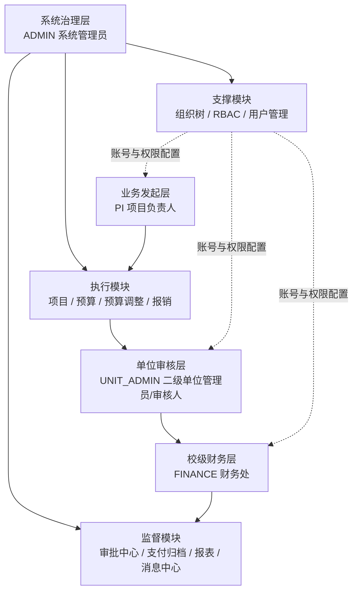

# 高校科研经费报销管理系统——组织机构图（简版）

> 依据当前代码中的角色模型、组织树接口、审批流接口与前端路由权限整理。

## 1) 组织机构图（建议用于文档/汇报）

## 2) 角色职责（简洁版）

| 角色 | 定位 | 关键职责 |
|---|---|---|
| ADMIN | 系统治理 | 维护组织、创建用户、分配角色、全局查看与审批 |
| PI | 业务发起 | 发起/维护项目、预算调整、报销等业务单据 |
| UNIT_ADMIN | 单位审核 | 处理本单位待办（单位审核节点） |
| FINANCE | 校级财务审核 | 处理财务复核与支付归档节点 |

## 3) 关键接口与组织关系映射

- **组织与权限治理（ADMIN）**
  - `/api/org/tree`：组织树查询（ADMIN）
  - `/api/rbac/roles`：角色字典（ADMIN）
  - `/api/admin/user/*`：用户创建、角色分配、状态维护
- **业务发起与流转**
  - 项目：`/api/project/*`
  - 预算：`/api/budget/*`
  - 预算调整：`/api/budgetAdjust/*`
  - 报销：`/api/reimburse/*`
- **审批与监督**
  - 审批中心：`/api/wf/*`（待办/已办/通过/驳回）
  - 支付：`/api/pay/*`
  - 归档：`/api/archive/*`
  - 报表：`/api/report/*`
  - 消息：`/api/msg/*`

## 4) 一句话总结

该系统采用“**管理员治理 + 项目负责人发起 + 二级单位审核 + 财务处终审/归档**”的分层组织模式，配套组织树与 RBAC 实现职责边界清晰、流程闭环可追踪。
